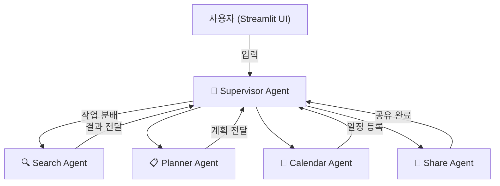
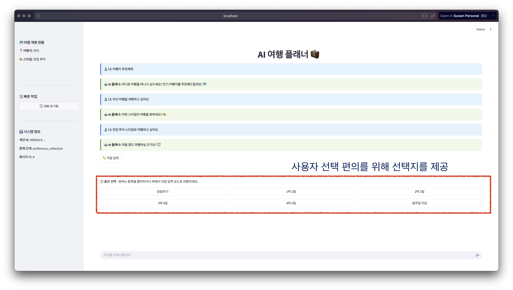
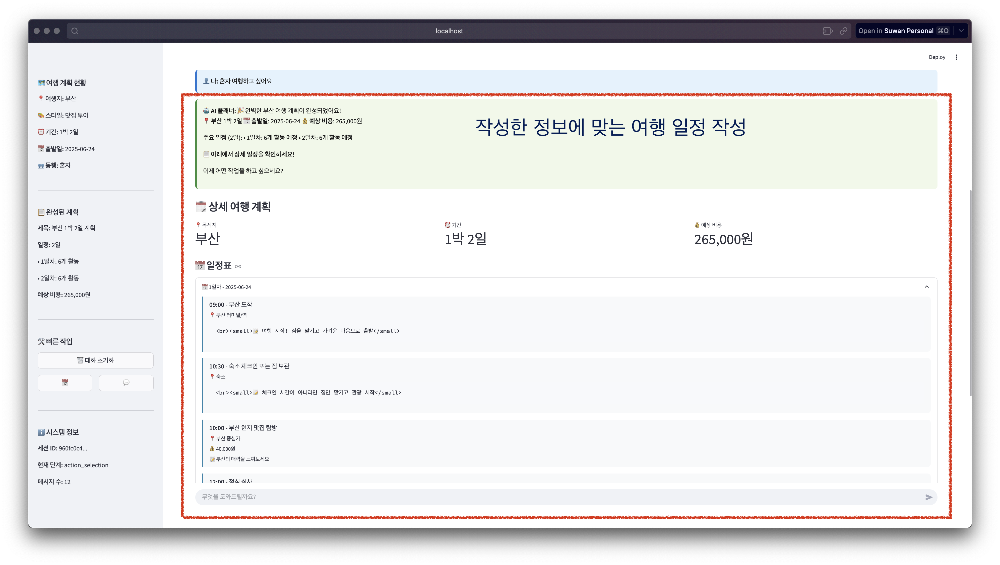
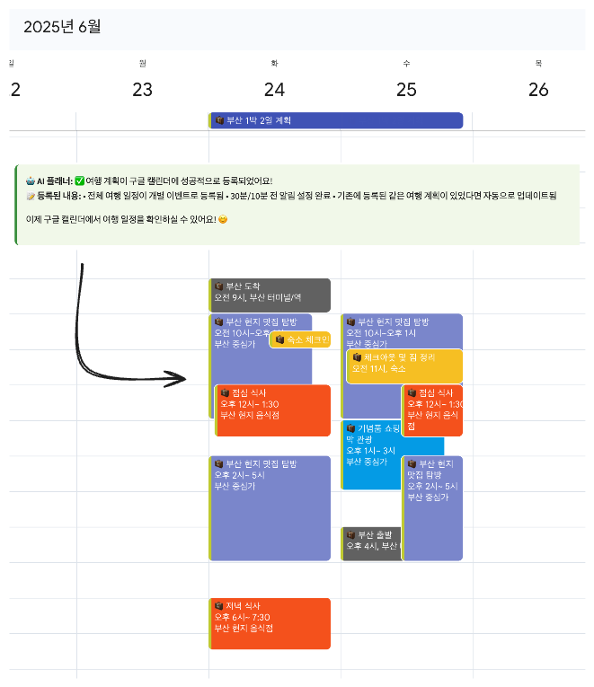
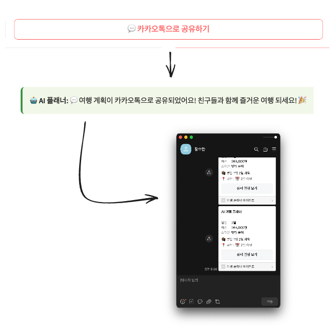

# AI 여행 플래너 - 멀티 에이전트 시스템

Supervisor 패턴을 기반으로 한 지능형 여행 계획 서비스입니다.

## 🎯 주요 기능

- **🔍 지능형 여행지 검색**: Tavily API를 활용한 실시간 여행 정보 검색
- **🤖 맞춤형 계획 생성**: 사용자 선호도 기반 개인화된 여행 일정 생성
- **📅 캘린더 연동**: Google Calendar 자동 등록 및 관리
- **💬 간편 공유**: 카카오톡을 통한 여행 계획 공유
- **💰 예산 관리**: 여행 스타일과 예산에 맞는 비용 계획

## 🏗️ 시스템 아키텍처

### Supervisor 패턴 기반 멀티 에이전트
```
사용자 (Streamlit UI)
    ↕️
🎯 Supervisor Agent (중앙 관리자)
    ↓ (작업 분배 및 조율)
┌─────────────┬─────────────┬─────────────┬─────────────┐
│ 🔍 Search   │ 📋 Planner  │ 📅 Calendar │ 💬 Share    │
│ Agent       │ Agent       │ Agent       │ Agent       │
└─────────────┴─────────────┴─────────────┴─────────────┘
```

**Call Flow**



### 각 에이전트 역할
- **Supervisor Agent**: 사용자와 직접 소통하며 다른 에이전트들을 조율
- **Search Agent**: Tavily를 활용한 여행 정보 검색
- **Planner Agent**: 여행 일정 생성 및 최적화
- **Calendar Agent**: Google Calendar 연동
- **Share Agent**: 카카오톡 공유 및 텍스트 포맷팅

## 사용 예시






## 🚀 설치 및 실행

### 1. 프로젝트 클론
```bash
git clone <repository-url>
cd travel-planner
```

### 2. Poetry 설치 (권장)
```bash
# macOS/Linux
curl -sSL https://install.python-poetry.org | python3 -

# Windows
(Invoke-WebRequest -Uri https://install.python-poetry.org -UseBasicParsing).Content | python -
```

### 3. 의존성 설치
```bash
poetry install
```

### 4. 환경 변수 설정
`.env` 파일을 생성하고 다음 API 키들을 설정하세요:

```env
# LLM
OPENAI_API_KEY=your_openai_api_key_here

# 검색용 키
TAVILY_API_KEY=your_tavily_api_key_here

# Google Calendar API
GOOGLE_CREDENTIALS_FILE=your_credentials_file_here
GOOGLE_TOKEN_FILE=your_token_file_here 

# 카카오톡 API
KAKAO_REST_API_KEY=your_kakao_rest_api_key_here
```

### 5. 애플리케이션 실행
```bash
# Poetry 사용 (권장)
poetry run streamlit run app.py --theme.base light
```

브라우저에서 `http://localhost:8501`로 접속

## 🔑 API 키 발급 방법

### OpenAI API 키
1. [OpenAI Platform](https://platform.openai.com/) 접속
2. API Keys 섹션에서 새 키 생성
3. `.env` 파일의 `OPENAI_API_KEY`에 설정

### Tavily API 키
1. [Tavily](https://tavily.com/) 회원가입
2. API 키 발급
3. `.env` 파일의 `TAVILY_API_KEY`에 설정

### Google Calendar API
1. [Google Cloud Console](https://console.cloud.google.com/) 접속
2. 새 프로젝트 생성 또는 기존 프로젝트 선택
3. Calendar API 활성화
4. OAuth 2.0 클라이언트 ID 생성
5. 클라이언트 ID와 시크릿을 `.env`에 설정

### Kakao API
1. [Kakao Developers](https://developers.kakao.com/) 접속
2. 애플리케이션 등록
3. REST API 키 발급
4. `.env` 파일에 설정

## 📁 프로젝트 구조

```
travel-planner/
├── app.py                  # Streamlit 메인 애플리케이션
├── pyproject.toml          # Poetry 의존성 관리
├── .env                    # 환경변수 (생성 필요)
├── config/                 # 설정 파일
│   └── constants.py        # 상수 정의
├── utils/                  # 유틸리티 함수
│   └── ui_helpers.py       # UI 헬퍼 함수
├── static/                 # 정적 파일
│   └── style.css           # CSS 스타일
├── agents/                 # 에이전트 모듈
│   ├── supervisor.py       # 중앙 관리 에이전트
│   ├── search_agent.py     # 검색 에이전트
│   ├── planner_agent.py    # 계획 생성 에이전트
│   ├── calendar_agent.py   # 캘린더 에이전트
│   └── share_agent.py      # 공유 에이전트
└── models/                 # 데이터 모델
    └── state_models.py     # 상태 관리 모델
```

## 🎮 사용법

### 1. 여행 계획 시작
- 애플리케이션 실행 후 원하는 여행지 입력
- 또는 추천 여행지에서 선택

### 2. 선호사항 설정
- 여행 스타일 선택 (문화/자연/맛집/쇼핑/액티비티/감성)
- 여행 기간 및 출발 날짜 설정
- 예산 범위 및 동행자 선택

### 3. 맞춤 계획 생성
- AI가 선택한 조건에 맞는 여행 계획 자동 생성
- 일정, 예산, 추천 장소 포함

### 4. 계획 활용
- **📅 캘린더 등록**: Google Calendar에 일정 자동 등록
- **💬 공유**: 카카오톡으로 친구들과 공유
- **📋 텍스트 복사**: 계획서를 텍스트로 복사
- **✏️ 계획 수정**: 필요시 세부사항 수정

## 🛠️ 개발자 정보

### 기술 스택
- **Frontend**: Streamlit
- **Backend**: Python, LangChain
- **AI Model**: OpenAI GPT-4
- **Search**: Tavily API
- **Calendar**: Google Calendar API
- **Messaging**: Kakao API

### 코드 구조
- **모듈화**: 기능별 에이전트 분리
- **타입 힌팅**: 코드 가독성 및 안정성
- **에러 처리**: 견고한 예외 처리
- **확장성**: 새로운 에이전트 추가 용이

## 🔧 고급 기능

### 캘린더 연동
- Google Calendar API를 통한 자동 일정 등록
- 일정별 알림 설정
- 여행 전체 기간 요약 이벤트 생성

### 지능형 검색
- Tavily API를 활용한 실시간 여행 정보
- 여행 스타일별 맞춤 검색
- 인기 여행지 자동 추천

### 예산 최적화
- 여행 스타일과 동행자에 따른 예산 분배
- 카테고리별 비용 추정
- 일별 예산 관리
